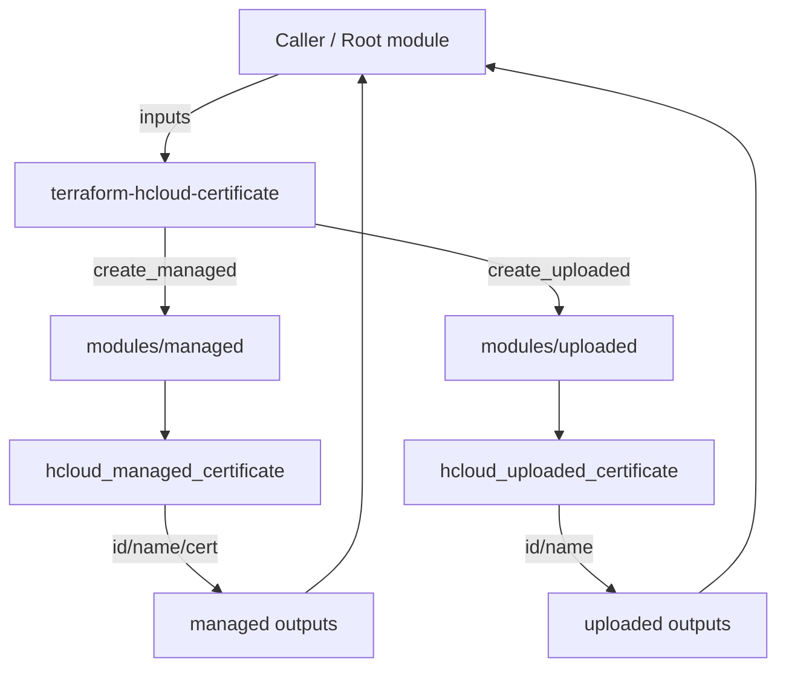

# Architecture

This module is a thin wrapper that can create either (or both) of:

- A **Managed** certificate (Let's Encrypt)
- An **Uploaded** certificate (user-provided PEM + private key)

The module exposes both **simple scalar outputs** (IDs/names) and **nested object outputs** for convenience.

## Data flow

## Typical usage

- Use **managed certificates** for public domains where Let's Encrypt validation is viable.
- Use **uploaded certificates** when you already have a certificate chain and key material.
- For **load balancers**, you typically attach certificate IDs to the load balancer HTTPS service.

